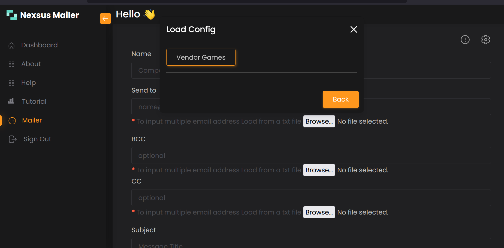

# Nexsus Mailer

An Email Application with main functionality written in php  
Get complete project - `☕:`[buymeacoffee](https://www.buymeacoffee.com/macanthony/e/202926)

## Features
- Send to multiple persons
- Load from file (txt)
- Inbuilt and Customizable template
- save settings and use anytime
- check status

## Modules
ckeditor 4 documentation [here](./ckeditor)

## library
- phpmailer  - documentation [here](https://github.com/PHPMailer/PHPMailer)
- sweetalert - documentation [here](https://github.com/t4t5/sweetalert)

## How to run:
1) Download the Zip file
2) Extract the file and and copy "nexsus" folder
3) paste inside root directory 
For xampp: "xampp/htdocs"
 For wamp:  "wamp/www"
 For lamp:  "var/www/HTML"
4) Open PHPMyAdmin (http://localhost/phpmyadmin)
5) Create a database with the name "xcgf"
6) Import xcgf.sql file (in the root directory)
7) Run the script http://localhost/nexsus

## Usage
* <b>On the Application go to settings</b>

* <b>Save configuration settings</b>

* <b>Load configuration settings</b>

* <b>Click on info to confirm settings</b>

* <b>Send message after filling the field</b>
